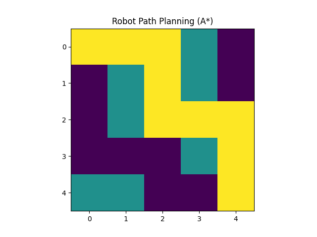

# Robot Path Planning Simulator (A*)

This project is a simple Python simulation showing how a robot can find a path from a start point to a goal while avoiding obstacles.

It uses the **A\*** (A-star) algorithm, which is commonly used in robotics, games, and autonomous navigation to find the shortest path.

---

## What This Project Does

The program creates a grid where:

- `0` represents free space the robot can move through  
- `1` represents obstacles the robot cannot cross  

The A* algorithm searches the grid and finds the **shortest path from the start position to the goal position**.

The result is displayed as a visualization showing the path the robot would take.

---

## Example Output

Below is an example of the path found by the algorithm.



---

## Files in This Project

```
robot-path-planning-simulator
│
├── path_planning_simulator.py
├── path_planning_output.png
└── README.md
```

- **path_planning_simulator.py** → Python code that runs the A* algorithm  
- **path_planning_output.png** → visualization of the path found  
- **README.md** → explanation of the project  

---

## How to Run the Project

Run the Python file:

```
python path_planning_simulator.py
```

The program will calculate the path and display the grid visualization.

---

## What I Learned

While building this project I explored:

- how path planning works in robotics
- how the A* algorithm searches for optimal paths
- how to visualize algorithm results using Python

---

## Tools Used

- Python  
- NumPy  
- Matplotlib
